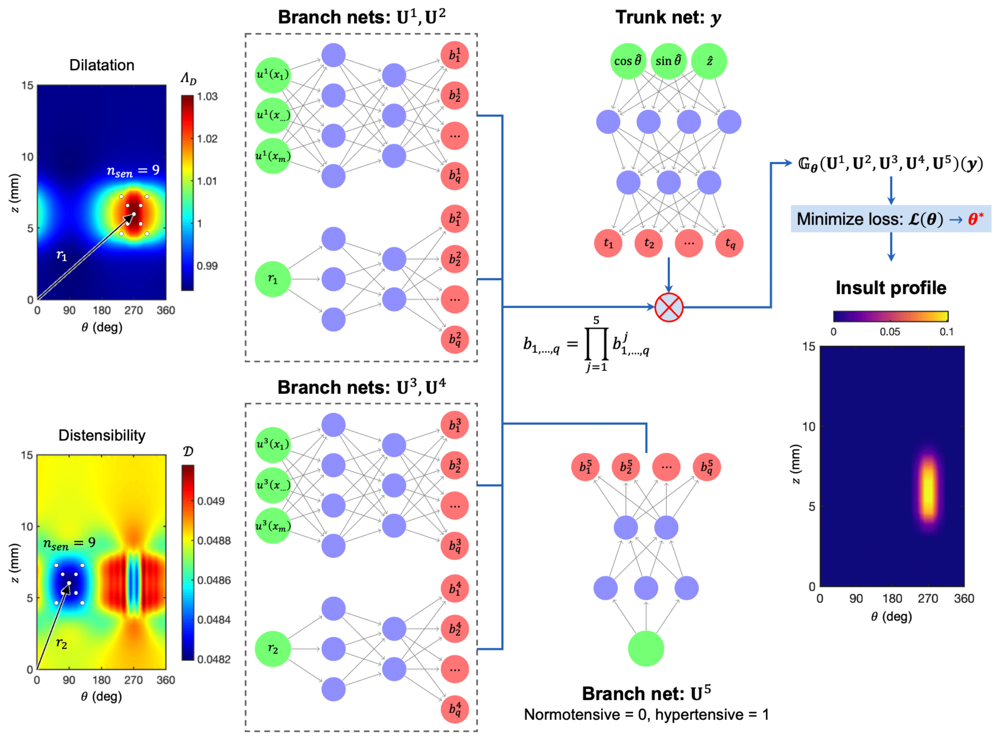
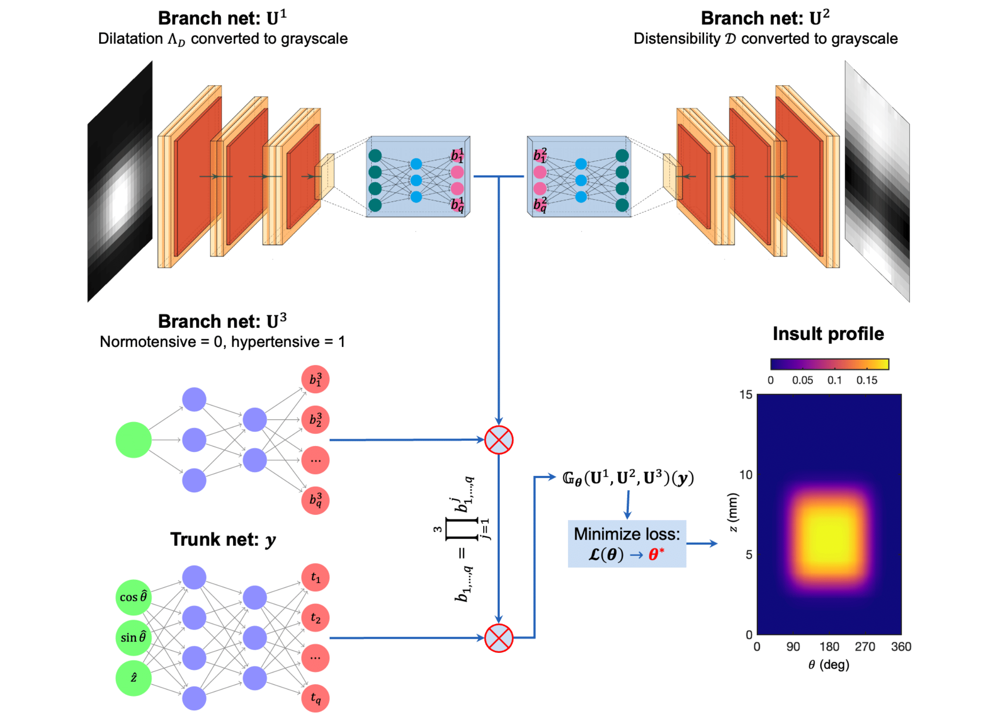

## Table of contents
* [General info](#general-info)
* [Methods](#methods)
* [Contents](#contents)
* [Datasets](#datasets)
* [Clone](#clone)

## General info

This Git repository contains codes for the **'Neural operator learning of heterogeneous mechanobiological insults contributing to aortic aneurysms'** paper which can be found here: [https://arxiv.org/pdf/2205.03780.pdf](https://arxiv.org/pdf/2205.03780.pdf).

Authors: [Somdatta Goswami](https://scholar.google.com/citations?user=GaKrpSkAAAAJ&hl=en&oi=sra), [David S. Li](https://scholar.google.com/citations?user=5mNu_m4AAAAJ&hl=en), [Bruno V. Rego](https://scholar.google.com/citations?user=AUf780sAAAAJ&hl=en), [Marcos Latorre](https://scholar.google.es/citations?user=hF7_7_sAAAAJ&hl=en), [Jay D. Humphrey](https://seas.yale.edu/faculty-research/faculty-directory/jay-humphrey), [George Em Karniadakis](https://scholar.google.com/citations?user=yZ0-ywkAAAAJ&hl=en).
## Methods

* **DeepONet** is a deep neural operator model that allows the construction of mapping between infinite dimensional functions via the use of deep neural networks (DNNs).
We have proposed two approaches based on how the sensors are located. 
* **Sparse Sensor Location** uses 25 or 9 sensor locations to approximate the aneurysm.

<p align="center">
  
</p>

* **Full Field Images** uses the entire image but in greyscale format to approximate the aneurysm.
<p align="center">
  
</p>

## Contents

* ```dataset``` - contains files to load the input random field for the train and test data of the model

* ```fnn``` - contains python scripts necessary for implementing the surrogate modeling tasks (forward passes)

* ```main_{}.py```/ ```main_{}.ipynb``` - contains python scripts and notebooks for implementing the proposed approaches

## Datasets

The datasets are generated in FEBio. Details of data generation are mentioned in the manuscript.

## Clone

To clone and use this repository, run the following terminal commands:

```
git clone https://github.com/somdattagoswami/Operator-Learning-for-aortic-aneurysms
cd Operator-Learning-for-aortic-aneurysms
pip install -r requirements.txt
```

## Citation

If you find this GitHub repository useful for your work, please consider citing this work:

```
@article{goswami2022neural,
  title={Neural operator learning of heterogeneous mechanobiological insults contributing to aortic aneurysms},
  author={Goswami, Somdatta and Li, David S and Rego, Bruno V and Latorre, Marcos and Humphrey, Jay D and Karniadakis, George Em},
  journal={arXiv preprint arXiv:2205.03780},
  year={2022}
}
```
______________________

### Contact
For more information or questions please contact us at:   
* somdatta_goswami@brown.edu
* d.s.li@yale.edu 
